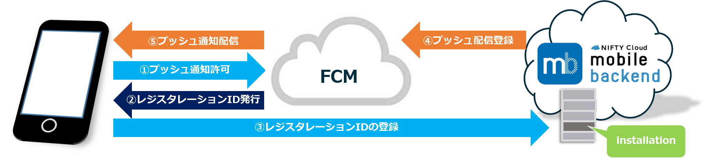
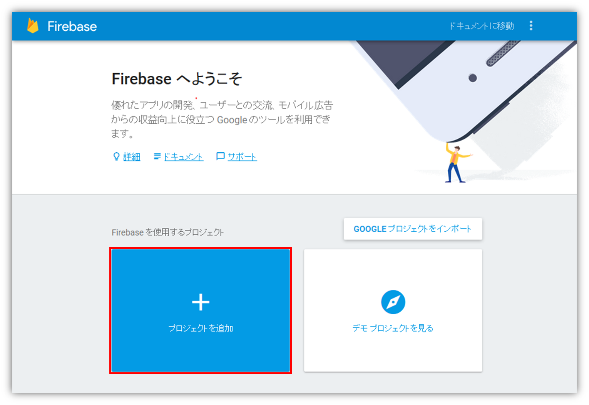
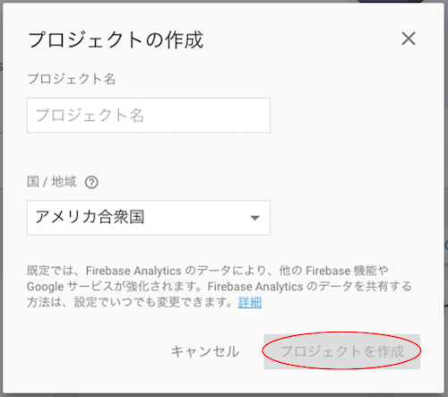
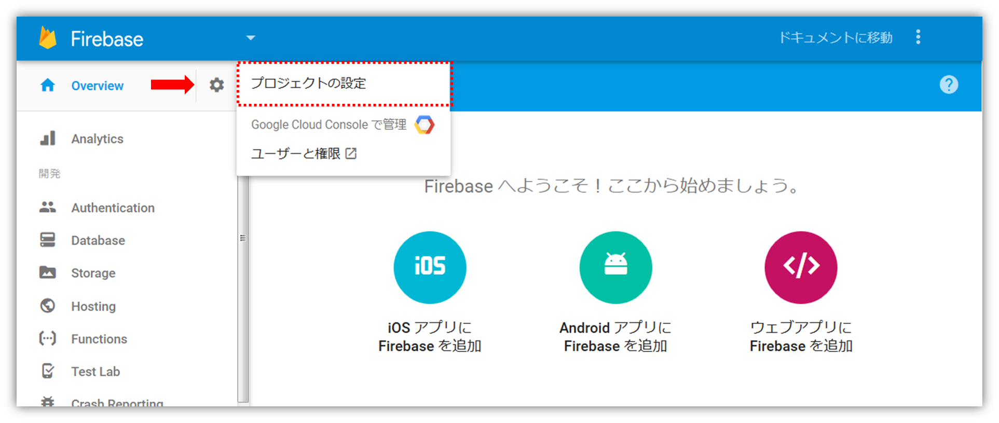
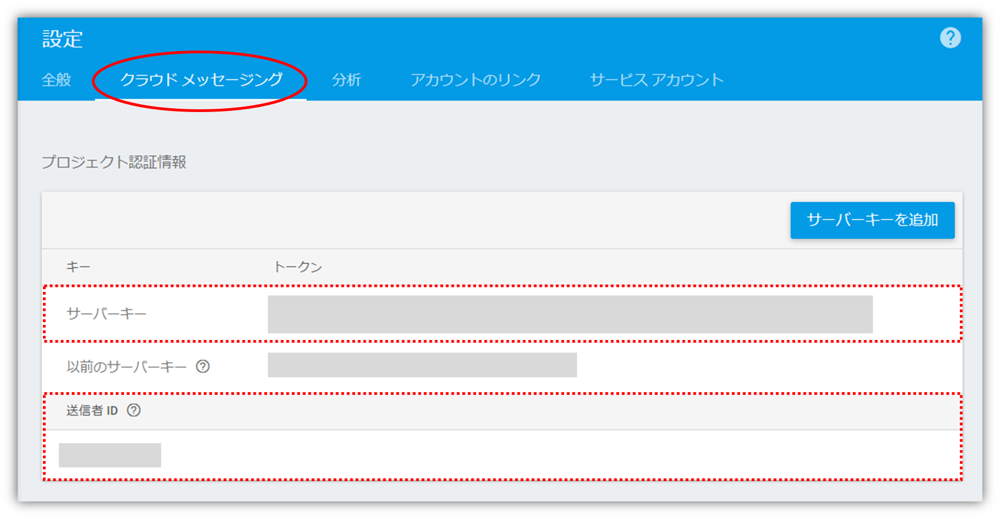

# 【Android】プッシュ通知の受信に必要なキーの発行方法
*2017/09/13作成*
  
アプリにプッシュ通知を組み込む際、必要な証明書のAPIキーの発行と設定の方法について解説します。

 
Android端末へのプッシュ通知は、__FCM__ (Firebase Cloud Messaging) と連携しています。mobile backend に登録されたプッシュ通知を FCM に配信登録することで、各端末にプッシュ通知が受信される仕組みです。

<small>※ FCM は GCM (Google Cloud Messaging) の新バージョンです。既に GCM にてプロジェクトの作成・GCMの有効化設定を終えている場合は、継続してご利用いただくことが可能です。新規で GCM をご利用いただくことはできませんので、ご了承ください。</small>

## 参考
* Androidプッシュ通知サンプル https://github.com/NIFTYCloud-mbaas/android_push_demo
* Monacaプッシュ通知サンプル https://github.com/NIFTYCloud-mbaas/MonacaPushApp
* Unityプッシュ通知サンプル https://github.com/NIFTYCloud-mbaas/unity_push_quickstart

## 事前準備
* Google アカウント（無料）の取得が必要です

## 作業手順
プッシュ通知を配信するためには、以下の２つのキーを使用します。

1. サーバーキー
1. 送信者ID

上記キーは、Firebase Console にてプロジェクトを作成することで発行されます。

* Firebase Console にアクセスします https://console.firebase.google.com/
  * Google アカウントでログインが必要です
* ログイン後プロジェクトの作成を行います
* 「プロジェクトの追加」をクリックします

* プロジェクトの作成画面が開くので、プロジェクト名と国/地域を入力し、「プロジェクトを作成」をクリックしてください

* 左メニューの設定アイコンから「プロジェクトの設定」を開きます

* 設定画面で「クラウドメッセージング」をクリックすると、プロジェクトキーに「サーバーキー」と「送信者ID」が確認できます

